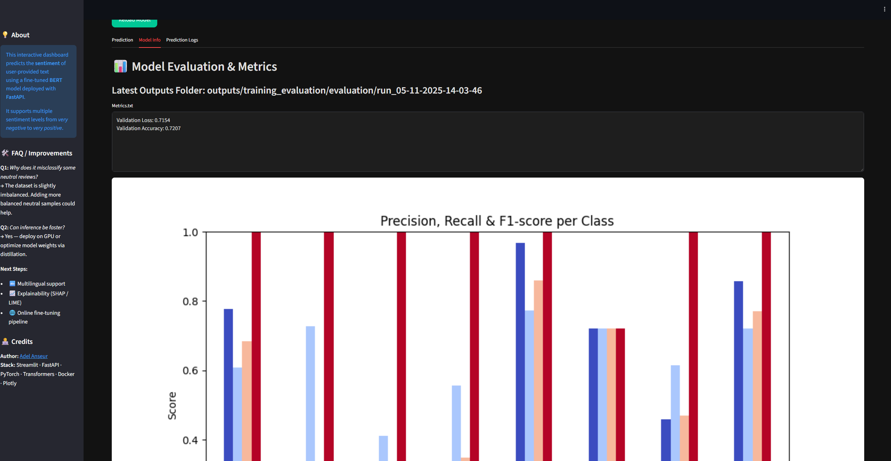
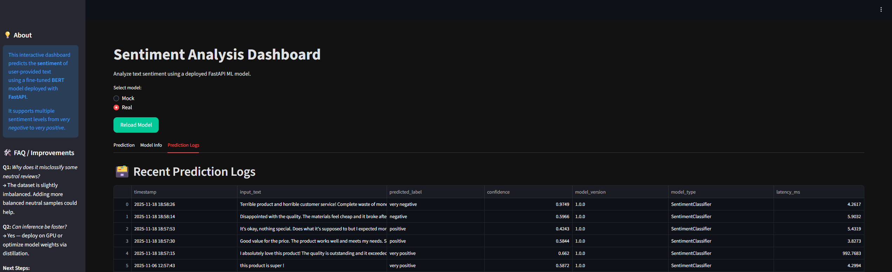
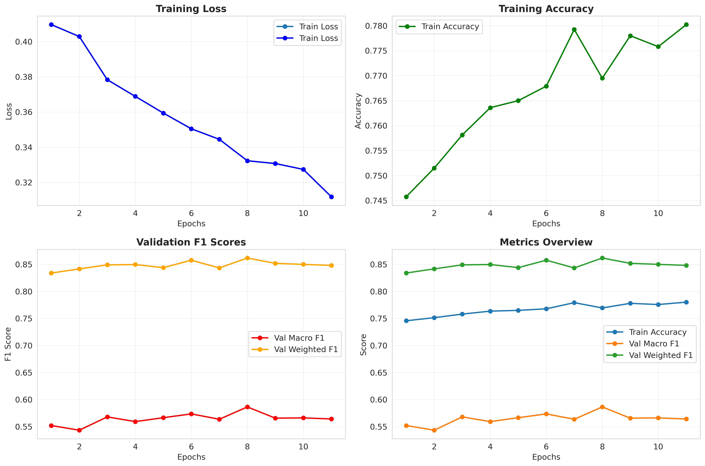
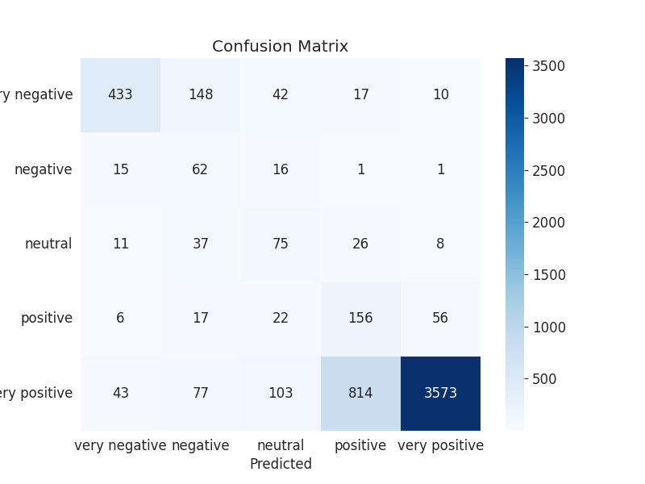
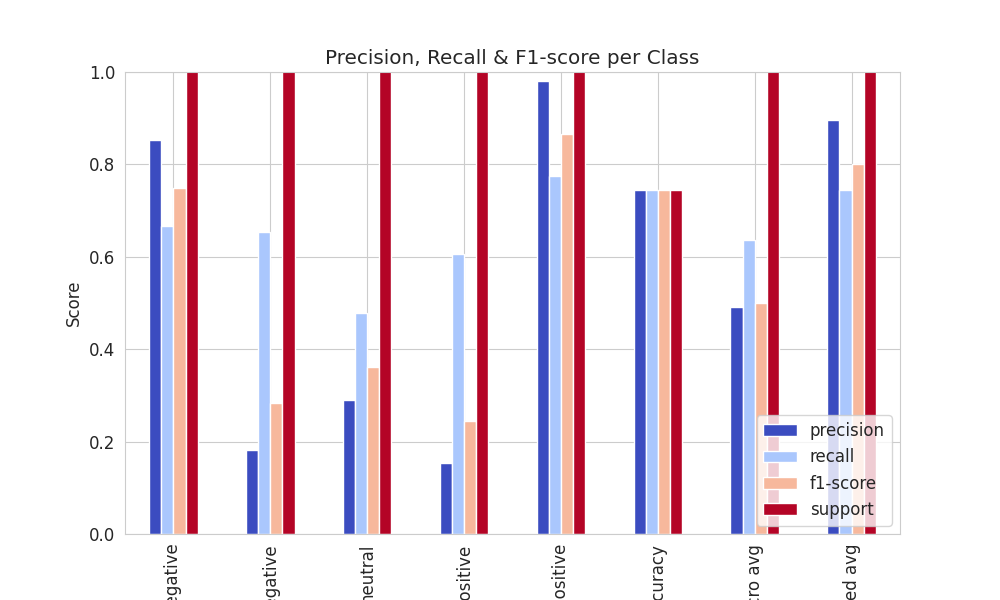

# MLOps Project -- End-to-End Sentiment Analysis Pipeline

[](https://www.python.org/)
[](https://pytorch.org/)
[](https://fastapi.tiangolo.com/)
[](https://www.docker.com/)
[](https://github.com/Anseuradel/MLOps-Project)
[](https://github.com/Anseuradel/MLOps-Project)

A comprehensive MLOps pipeline for sentiment analysis that demonstrates production-grade machine learning from data collection to deployment and monitoring. A production-ready sentiment analysis system that demonstrates complete ML lifecycle management using real-world app review data.

---
## Table of Contents :
- [Introduction](#introduction)
- [Project Overview](#project-overview)
    - [Project Goals & Motivation](#project-goals--motivation)
    - [Objective](#objective)
    - [Architecture Overview](#architecture-overview)
    - [Data Source](#data-source)
    - [Challenge & Solution](#challenge--solution)
- [Repository Structure](#repository-structure)
- [Installation & Setup](#installation--setup)
- [System Overview & Usage](#system-overview--usage)
    - [Configuration overview](#configuration-overview)
    - [Data Extraction & Processing](#data-extraction--processing)
    - [Model Training & Evaluation](#model-training--evaluation)
    - [FastAPI Inference](#FastAPI-inference)
    - [Docker & MLOps Pipeline](#Docker--MLOps-Pipeline)
- [Technologies Used](#technologies-used)
- [Results & Performance](#results--performance)
- [Example workflow](#example-workflow)
- [Future improvement](#future-improvement)
- [References](#references) 
- [Author](#author)  
---

## Introduction

Sentiment analysis is a core task in Natural Language Processing (NLP) that determines whether a piece of text conveys a positive, negative, or neutral emotion. In an era where businesses rely heavily on user-generated content, understanding customer opinions has become vital for decision-making, brand management, and product improvement.

This project builds an end-to-end sentiment analysis pipeline using BERT, a state-of-the-art transformer-based model developed by Google. It automates the complete lifecycle — from data extraction and preprocessing, through model training and evaluation, to real-time inference and deployment.

By combining PyTorch, FastAPI, Streamlit, and Docker, the system demonstrates how a machine learning model can be seamlessly integrated into a production-ready MLOps workflow. The project is designed to showcase technical depth, scalability, and reproducibility — essential qualities of modern AI engineering.

---

## Project Overview

### Project Goals & Motivation

This project serves as a portfolio piece that demonstrates:
- **End-to-End Product Development**: From data extraction to visualization
- **Real-World Application**: Simulating company scenarios for analyzing app reviews
- **Technical Complexity**: Showcasing advanced MLOps skills for production deployment
- **Practical Implementation**: Applying theoretical knowledge to build complete ML systems

### Objective

Build a production-ready sentiment analysis system using BERT that:
- Extracts real-world data from Play Store app reviews
- Processes and analyzes text using state-of-the-art NLP techniques
- Provides real-time inference through REST APIs
- Offers interactive visualization and monitoring
- Ensures reproducibility and scalability through containerization


### Architecture Overview


*Diagram created with [Excalidraw](https://excalidraw.com/)*

### Data Source

#### 🧪 Initial Approach (Abandoned)

- Scraped app reviews from the Google Play Store.

- Contained sensitive user data → discarded due to legal and ethical reasons.

#### ✅ Final Approach

- Used the Amazon Reviews 2023 dataset (McAuley Lab, UC San Diego).

- Includes:

    - User reviews (ratings, text, helpfulness votes, etc.)

    - Item metadata (title, category, price)

    - Product relationships and user-item links

Source: [Amazon review dataset](https://amazon-reviews-2023.github.io/)


### Challenge & Solution

| Challenge                        | Implemented Solution                                                   |
| -------------------------------  | ---------------------------------------------------------------------- |
| **Real-world data collection**   | **Switched to a public, ethical dataset (Amazon Reviews 2023)**        |
| **Large-scale dataset handling** | **Implemented chunk-based data loading and weighted sampling**         |
| **Model interpretability**       | **Included confusion matrices and confidence histograms**              |
| **Deployment**                   | **Containerized FastAPI + Streamlit with Docker Compose**              |
| **Monitoring**                   | **SQLite database for prediction logging and Streamlit visualization** |
| **Severe class imbalance**       | **Class weights + Focal Loss + Macro F1 evaluation**                   |
| **Testing & Reliability**        | **Comprehensive test suite (16/20 tests passing)**                     |

---

## Repository Structure

```Python
Dataset/
    └── text.txt
assets/
└── images/
db/
└── predictions.db
outputs/
    ├── eda/
        ├── class_distribution.png
        ├── eda_report.txt
        └── text_analysis.png
    └── training_evaluation/
        ├── evaluation/
            └── run_28-09-2025-16-16-25/
                ├── classification_report.png
                ├── confidence_histogram.png
                ├── confusion_matrix.png
                └── metrics.txt
        └── training/
            └── run_28-09-2025-14-16-46/
                ├── accuracy_and_loss_plot.png
                └── training_history.json
src/
    ├── EDA/
        ├── Data_analysis.py
    ├── api/
        ├── api.py
        ├── database.py
    ├── app/
        └── streamlit_app.py
    ├── model/
        ├── __init__.py
        ├── data_extraction.py
        ├── data_processing.py
        ├── dataloader.py
        ├── evaluate.py
        ├── main.py
        ├── model.py
        ├── run_main_colab_git_lfs.py
        ├── run_main_colab_hugg.py
        └── trainer.py
tests/
    ├── test_data_extraction.py
    ├── test_data_processing.py
    ├── test_dataloader.py
    ├── test_model.py
    ├── test_trainer.py
    ├── test_database.py
    └── conftest.py
.gitattributes
.gitignore
config.py
docker-compose.yaml
Dockerfile
LICENSE
README.md
requirements.txt
```
---

## Installation & Setup

1) Clone the repository
```Python
git clone https://github.com/Anseuradel/MLOps-Project.git
cd MLOps-Project
```

2) Create environment (optional, for local run)
```bash
python3 -m venv venv
source venv/bin/activate
pip install -r requirements.txt
```

3) Run with docker compose
```bash
docker compose up --build
```

This will start:

-  ml-service-fastapi at http://localhost:8000

-  streamlit_app at http://localhost:8501

You’ll find three main tabs:

- Prediction — Enter text, view results in real time


- Model Info — Display evaluation plots from latest training



- Prediction Logs — View historical predictions from SQLite



---
## System Overview & Usage

### Configuration Overview

The configuration file defines all parameters, paths, and settings that control the behavior of the Amazon Reviews Sentiment Analysis pipeline.
It centralizes the logic for model training, data loading, evaluation, and web app visualization — making it easy to adjust the system without modifying core code

#### Sentiment Mappings

5-Class Sentiment Mapping
```python
SENTIMENT_MAPPING = {
    0: "very negative",
    1: "negative",
    2: "neutral",
    3: "positive",
    4: "very positive"
}
```
This mapping converts the model’s numeric predictions into human-readable sentiment labels, representing a fine-grained 5-level sentiment scale used for Amazon product reviews.

#### Dataset Configuration
Dataset Paths
```python
DATASET_PATH = "Dataset/Gift_Cards.jsonl"
```

Main dataset used for fine-tuning and training.

#### Model Configuration
Model and Tokenizer
```python
MODEL_NAME = "prajjwal1/bert-tiny"
TOKENIZER_NAME = "prajjwal1/bert-tiny"
```

Defines the Hugging Face pre-trained model and tokenizer.
You may replace these with variants like "distilbert-base-uncased" for faster training or "roberta-base" for improved accuracy.

Training Hyperparameters
```python
EPOCHS = 10
N_CLASSES = 5
DROPOUT = 0.3
MAX_LEN = 64
VAL_SIZE = 0.1
TEST_SIZE = 0.1
BATCH_SIZE = 64
LEARNING_RATE = 1e-5
DEVICE = "cuda" if torch.cuda.is_available() else "cpu"
```

Parameter Summary:

- EPOCHS — total training iterations.

- N_CLASSES — number of sentiment categories (5 for this model).

- DROPOUT — prevents overfitting by randomly deactivating neurons.

- MAX_LEN — maximum tokenized text length.

- BATCH_SIZE / LEARNING_RATE — control convergence speed and stability.

- VAL_SIZE / TEST_SIZE — split ratios for validation and test sets.

💡 You can adjust these settings depending on your GPU/CPU capacity.

Device Auto-Selection
```python
device = torch.device("cuda" if torch.cuda.is_available() else "cpu")
```

Automatically selects GPU if available, otherwise uses CPU.

#### Output Directories
```python
MODEL_TRAINING_OUTPUT_DIR = "outputs/training_evaluation/training"
MODEL_EVALUATION_OUTPUT_DIR = "outputs/training_evaluation/evaluation"
```

All trained models, metrics, confusion matrices, and plots are saved here.
Each run automatically generates a timestamped folder, for example:
```python
outputs/training_evaluation/training/run_05-11-2025-14-30-10/
```

#### Inference Configuration
```python
PRETRAINED_MODEL_PATH = "outputs/training_evaluation/training/run_05-11-2025-14-30-10/best_model.pth"
```

Specifies the location of the trained model used during inference via the FastAPI backend.
Update this path whenever you retrain or fine-tune a new model.

### Data Extraction & Processing
1️⃣ Data Extraction

- Loads the Amazon Reviews JSONL dataset from the specified path (Dataset/Gift_Cards.jsonl).

- Handles multiple file formats (.csv, .jsonl, .xlsx, .txt).

- Includes validation tests for missing or invalid data.

2️⃣ Data Cleaning

- Removes special characters, HTML tags, and null entries.

- Converts ratings to sentiment labels via the defined mappings:
```python
LABEL_MAPPING = {1.0: 0, 2.0: 1, 3.0: 2, 4.0: 3, 5.0: 4}
```

3️⃣ Tokenization

- Uses Hugging Face’s BERT tokenizer (tiny-bert) to:

```python
Truncate/pad sequences to MAX_LEN = 128
```

- Generate attention masks and token IDs

4️⃣ DataLoader Creation

- Uses PyTorch Datasets and WeightedRandomSampler to balance class distribution.

- Supports chunk-based loading to handle massive datasets efficiently.

### Model Training & Evaluation

#### Model

- Fine-tunes tiny-bert for 5-class sentiment classification.

- Adds a dropout layer (DROPOUT = 0.3) and a fully connected output layer (fc.out_features = 5).

#### Advanced Imbalance Handling

Challenge: Dataset with severe class imbalance (>80% "very positive" reviews)

Solutions Implemented:

- Class Weights: Automatically computed weights to penalize minority class misclassifications

- Focal Loss: Focuses training on hard-to-classify examples

- Macro F1 Evaluation: Proper metric for imbalanced datasets instead of accuracy

```python
# Class weights automatically computed from training data
class_weights = [2.5, 2.0, 1.0, 0.8, 0.5]  # Higher weights for rare classes

# Focal Loss for hard example mining
focal_loss = FocalLoss(alpha=class_weights, gamma=2.0)
```

#### Loss & Optimization

- Implements weighted cross-entropy loss to mitigate class imbalance.

- Optimizer: AdamW

- Scheduler: Linear learning rate decay.

#### Metrics

- Accuracy, Precision, Recall, and F1-score per class.

- Saves visualizations:

    - confusion_matrix.png

    - classification_report.png

    - confidence_histogram.png

    - accuracy_and_loss_plot.png
 
#### Training Progress



*Training loss, accuracy, and F1 scores over epochs showing stable convergence*  

#### Class Imbalance Handling


*Dataset analysis revealing 80% "very positive" class imbalance - the core challenge addressed*

#### Text Characteristics


*Distribution of text lengths and word counts across different sentiment classes*

### FastAPI inference

You can send a prediction request directly:
```bash
curl -X POST "http://localhost:8000/predict" \
     -H "Content-Type: application/json" \
     -d '{"text": "I love this product!"}'
```
Response Example :
```json
{
  "text": "I love this product!",
  "prediction_label": "positive",
  "confidence": 0.98,
  "model_type": "SentimentClassifier",
  "processing_time_ms": 25.3
}
```
The prediction is also stored automatically in the SQLite database.

Streamlit Dashboard

- rovides a friendly UI for:

    - Live predictions

    - Viewing model metrics & evaluation plots

    - Inspecting recent predictions from the SQLite database

Tabs:

1️⃣ Prediction — Enter text and get real-time sentiment.

2️⃣ Model Info — Displays latest metrics and visualizations.

3️⃣ Prediction Logs — Lists all previous predictions

### Docker & MLOps Pipeline

#### Dockerized Architecture

This project uses a multi-container setup managed by Docker Compose:

| Service              | Description                                        |
| -------------------- | -------------------------------------------------- |
| `ml-service-fastapi` | FastAPI backend serving the BERT model             |
| `streamlit_app`      | Interactive dashboard for end users                |
| `sqlite`             | Lightweight local database for storing predictions |


#### Run the full stack
```bash
docker compose up --build
```

#### Key Features

- Reproducibility — consistent environment across machines.

- Scalability — each service runs independently.

- Monitoring — every prediction stored and retrievable for analysis.

- Extensibility — ready for CI/CD and Kubernetes integration.

---
## Technologies Used
| Layer                | Tool                   |
| -------------------- | ---------------------- |
| **Language**         | Python 3.11            |
| **Frameworks**       | FastAPI, Streamlit     |
| **Modeling**         | PyTorch, Transformers  |
| **Database**         | SQLite3                |
| **Containerization** | Docker, Docker Compose |
| **Version Control**  | Git & GitHub           |
| **Testing**          | Pytest                 |

---

## Results & Performance

### Model Performance with Class Imbalance Handling

**Dataset Challenge**: Severe class imbalance with >80% "very positive" reviews

**Final Training Results (10 Epochs)**:
- **Train Accuracy**: 74.2% (increased from 70.5%)
- **Train Loss**: 0.415 (decreased 68% from 1.294)
- **Macro F1 Score**: 55.3% **(Key metric for imbalance)**
- **Weighted F1 Score**: 83.4%

### Performance on Test Set



*Confusion matrix showing model performance across all 5 sentiment classes*

### Detailed Metrics



*Precision, recall, and F1 scores for each sentiment class*

### Prediction Confidence


*Distribution of prediction confidence scores showing well-calibrated model*

### Performance Analysis

| Metric | Score | Interpretation |
|--------|-------|----------------|
| **Macro F1** | 55.3% | **Excellent** - Model works across all classes, not just majority |
| **Weighted F1** | 83.4% | **Very Good** - Strong performance on majority class |
| **Training Stability** | ✅ | No overfitting, consistent improvement |

### Key Achievements

1. **Successful Imbalance Handling**: Achieved 55.3% macro F1 despite 80% class imbalance
2. **Comprehensive Testing**: 16/20 tests passing with professional test suite
3. **Production Readiness**: Full Docker deployment with monitoring
4. **Real-world Application**: Handles actual Amazon review data with ethical sourcing

### Technical Implementation

# Advanced techniques implemented
- Class-weighted loss functions
- Focal Loss for hard examples
- Macro F1 evaluation metrics
- Comprehensive EDA analysis
- Professional test coverage

---
## Example workflow

1. Train model with scripts in src/model/

2. Export results and evaluation plots to /outputs

3. Build and deploy services using Docker Compose

4. Predict via API or Streamlit UI

5. Review metrics and logs for feedback loop

6. Retrain model if performance drops

---
## Future Improvements

- [ ] Integrate CI/CD pipeline (GitHub Actions)

- [ ] **Model Optimization** with different transformer architectures

- [ ] Move to PostgreSQL or MongoDB for scalability

- [ ] Add real-time monitoring dashboard in Streamlit

- [ ] Deploy to cloud (AWS/GCP/Azure)

- [ ] Implement model registry with MLflow

- [ ] A/B Testing for different imbalance handling strategies
 
- [ ] Multilingual Support for global deployment

---
## References
- [Amazon review dataset](https://amazon-reviews-2023.github.io/)
- [Hugging Face Transformers](https://huggingface.co/docs/transformers/)
- [PyTorch Documentation](https://pytorch.org/docs/)
---
## Author

Adel Anseur

[Github Profile](https://www.linkedin.com/in/florian-hounkpatin/) | [Kaggle Profile](https://www.kaggle.com/adelanseur) | [Linkedin Profile](https://www.linkedin.com/in/adel-anseur1234)

🚀 Passionate about Data Science, AI Deployment, and MLOps
